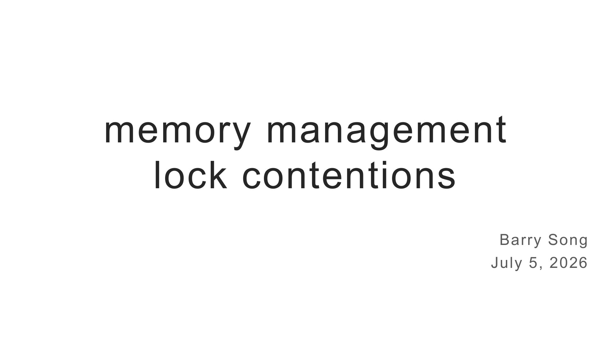
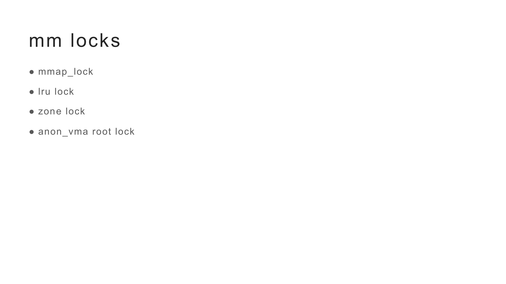
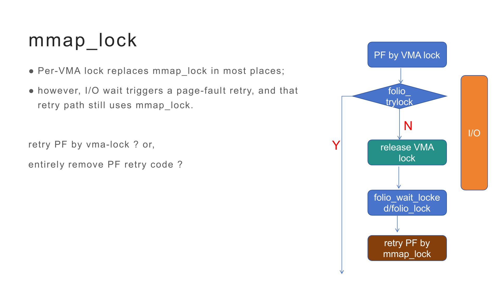
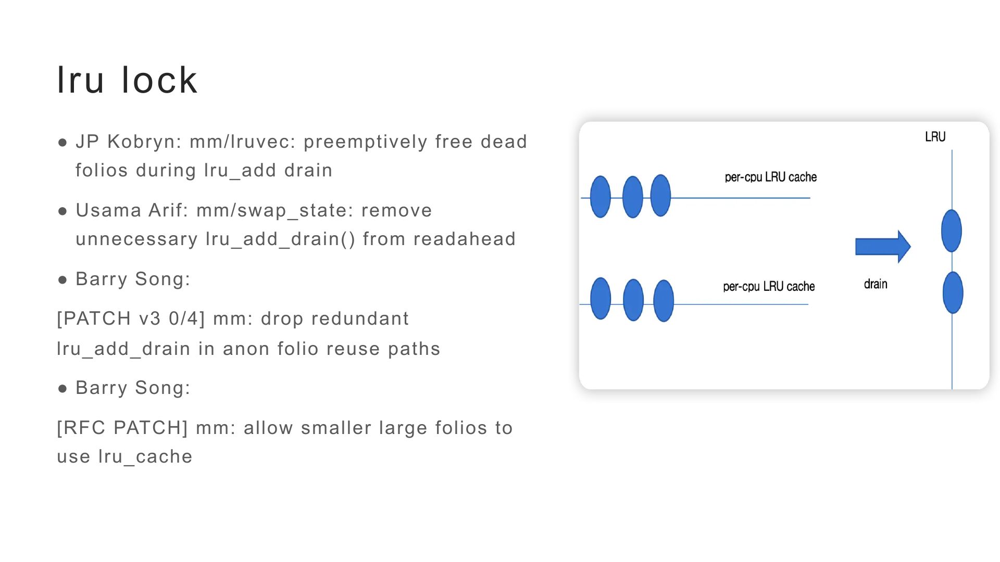
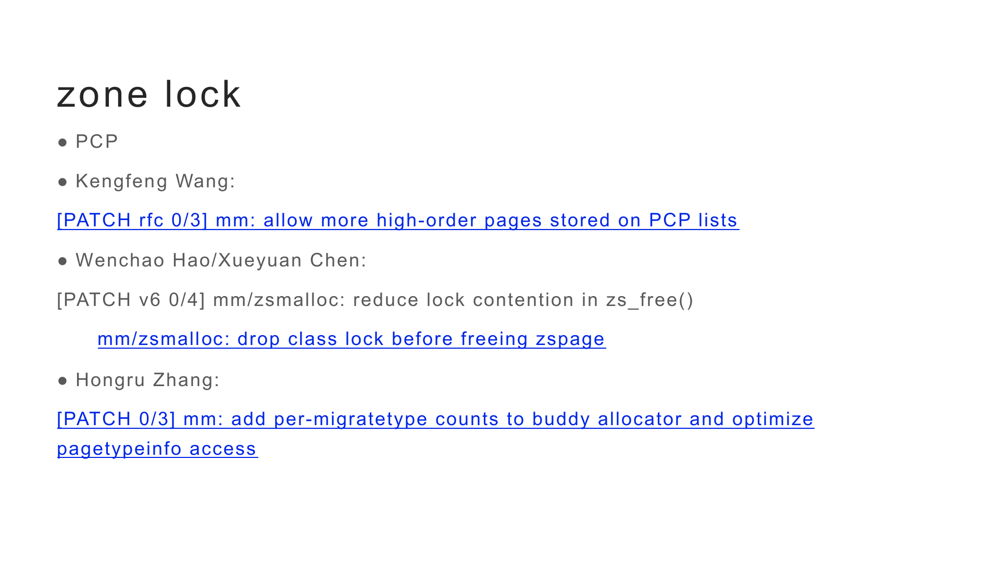
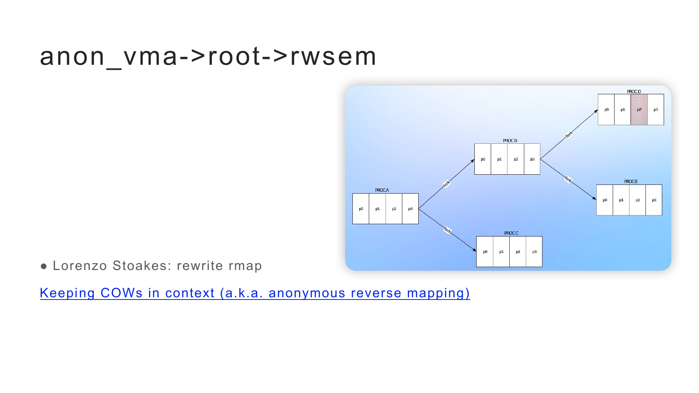

# Memory Management Lock Contentions｜会议演讲逐字稿

- 演讲者：宋宝华（Barry Song）
- 演讲日期：2026 年 7 月 5 日
- 演示文稿：`mm lock contentions.pptx`
- 英文版本：[English transcript](../en/宋宝华-memory-management-lock-contentions.md)

## 开场

**主持人：** 你直接看 PPT，应该已经给你开共享了。你往下翻页就行。

**宋宝华：** 好的，谢谢。非常感谢大家今天来参加活动。

这份 slide 是 7 月 5 日写的。昨天晚上大概 11 点钟开始写，12 点的时候我想躺 5 分钟，结果一躺就睡着了，今天早上才把它写完。

我想简单聊一下内存管理系统里的几类锁竞争，包括我们正在做的工作，以及其他老师和社区开发者的一些工作。今天主要讲四个锁：`mmap_lock`、LRU lock、zone lock，以及 `anon_vma->root->rwsem`。

## `mmap_lock`

**宋宝华：** 第一个是 `mmap_lock`。说起这个话题有点伤心，因为我在社区里讨论得很痛苦。

最开始，很多地方都使用 `mmap_lock`；后来 per-VMA lock 合入内核，在绝大多数场景下，page fault 与其他可能修改 VMA 的逻辑之间，可以只通过 VMA lock 来同步。

但还有一条路径可能引起 `mmap_lock` 竞争。比如现在发生一次 page fault，我们通过 VMA lock 进入 fault 处理。理论上，只要 page fault 处理期间 VMA 保持不变就可以了。接下来，如果 fault 发生在文件映射中，就可能需要读取 I/O。I/O 队列可能很长，文件系统里也可能正在做 GC，所以这个过程可能很慢。

原有逻辑在发现 folio 还不是 up-to-date、需要等待 I/O 时，会先释放当前持有的 VMA 或 `mmap_lock`，等待 I/O 完成，然后重试 page fault。问题是，这条 retry 路径仍然会回到 `mmap_lock`，因此又可能造成锁竞争。

现在有两种解决思路。

第一种是保留 page fault retry：做 I/O 前，不管当前拿的是 VMA lock 还是 `mmap_lock`，都先把锁释放；等 I/O 完成后，再用 VMA lock 重试 page fault，而不是回退到 `mmap_lock`。这样可以解决这条路径上的竞争。

第二种是彻底移除这部分 page fault retry 代码。既然现在 fault 主要使用 VMA lock，那么遇到 I/O 时就继续持有 VMA lock，等 I/O 完成后把整个 fault 流程处理完，不再重试。

目前主要的争议就是应该采用哪种方式。我之前一直在推动第一种方案，社区里也有人希望推动第二种方案，所以这件事还在讨论。

## LRU lock

**宋宝华：** LRU lock 的竞争在内存管理里也比较严重。比如，向 page cache 添加一个新 folio 后，需要把 folio 加到 LRU；从 LRU 删除 folio，或者进行内存回收时，也都可能需要用 spinlock 锁住 LRU。

为了减小竞争，当前内核为每个 CPU 设置了 per-CPU LRU cache。新增的 folio 会先放到当前 CPU 的批处理中；等批处理满了，或者遇到当前批处理机制不能容纳的 large folio，再把 per-CPU cache 中的内容 drain 到 LRU。这个 drain 过程需要拿 LRU lock，因此一直是大家比较关注的竞争点。

社区讨论过很多方案。比如，给文件页和匿名页使用不同的 spinlock；也有人建议把内存划成多个区块，例如 32 GiB 内存每 4 GiB 使用一把锁。不过，这些方案都会显著增加内核的复杂度。

最近我看到两个很好的工作。

第一个是 JP Kobryn 的补丁：`mm/lruvec: preemptively free dead folios during lru_add drain`。在把 per-CPU LRU cache drain 到 LRU 的过程中，有些 folio 实际上已经“死了”，唯一剩余的引用就是 batch 本身。如果发现 folio 只有这一处引用，就没必要先把它加入 LRU，再等回收算法碰到它后释放。可以在 drain 时直接释放，避免无效的 LRU 操作和锁开销。

第二个是 Usama Arif 的补丁：`mm/swap_state: remove unnecessary lru_add_drain() from readahead`。他发现 swapin readahead 路径会反复调用 `lru_add_drain()`，其中一些 drain 完全没有必要。

看到这两个工作后，我又检查了内核里的类似路径，发现匿名 folio 复用流程里也有多余的 drain。一个是 `wp_can_reuse_anon_folio()`，另一个是 `do_swap_page()`。这些路径在某些场景下会反复 drain per-CPU LRU cache，但实际上并不需要。这段时间我主要就在做这个工作，Kairui 也一直帮忙 review。

我还看到另一个机会：当前 per-CPU LRU cache 对 large folio 的支持有限，只要遇到不支持的 large folio，就需要先把 cache drain 出去。但如果系统里主要配置的是较小的 large folio，比如 order-2 或 order-4 folio，它们的大小仍然比较可控，理论上也可以进入 per-CPU LRU cache。

我做了一个实验，让 20 个线程持续触发 page fault。把这类较小的 large folio 放进 per-CPU LRU cache 后，LRU lock contention 明显下降，多线程程序的运行时间也减少了。这个工作最近还在继续，后面可能还要发新版本。

## zone lock

**宋宝华：** zone lock 的竞争不一定像前两类锁那么激烈，因为现在已经有 PCP，也就是 per-CPU pages。PPT 这里原来写错了，我临时改一下，昨天确实没睡好，不好意思。

Kefeng Wang 之前做过一组补丁，允许把指定的 high-order pages 放到 PCP list。比如系统主要使用 order-4 folio，能不能也把 order-4 pages 放进 PCP？他的实验表明，一些特定场景下的锁竞争确实会下降，但效果没有那么显著，所以这项工作后来没有继续。

不过我在想，如果系统配置的主要是 64 KiB large folio，那么这种 folio 的地位可能就类似过去的 order-0 folio。把它放进 PCP，理论上仍可能减少 zone lock contention。另一种可能是，64 KiB folio 已经比较大，系统里的 folio 数量随之减少，zone lock contention 本来就没有 order-0 folio 那么严重，因此收益未必很大。这方面还可以继续观察。

最近，Xueyuan Chen 和 Wenchao Hao 在 `zsmalloc` 的 `zs_free()` 路径上做了一项工作。这是一条非常频繁的路径，zswap 和 zram 在释放对象时都会走到这里。

原来的 `zs_free()` 会涉及 `pool->lock` 和 `class->lock`；在释放整个 zspage、把页面还给 buddy allocator 时，还会进入 zone lock。也就是说，`class->lock` 与 zone lock 可能嵌套在一起。Xueyuan 和 Wenchao 的工作把这两类锁拆开：在前半段持有 `class->lock` 时，只用临时变量保存待释放的 zspage；等 `class->lock` 解锁后，再真正释放 zspage，把页面还给 buddy allocator。这样就避免了两类锁相互牵连。

我之前还看到 Hongru Zhang 处理过另一个问题。读取 `/proc/pagetypeinfo` 时，内核需要拿 zone lock，扫描 buddy allocator 中各个 `free_area` 的空闲链表，统计每种 migratetype 下有多少内存。这个扫描可能持续很长时间。

他的方案是在 buddy allocator 中直接维护 per-migratetype 计数。这样读取 `/proc/pagetypeinfo` 时就可以使用现成的统计，而不必在 zone lock 下逐条扫描空闲链表。不过，维护这些计数会给内存分配和释放路径增加一点开销，而 `/proc/pagetypeinfo` 又不一定是所有系统里的常见热路径，所以社区对这个方案还没有达成一致。

## `anon_vma->root->rwsem`

**宋宝华：** 最后一类是 anonymous VMA 的 root lock，也就是 `anon_vma->root->rwsem`。Lorenzo Stoakes 之前讲过这个问题。

假设进程 A fork 出 B 和 C，B 又 fork 出 D 和 E。随着多轮 fork 和 COW，这些进程的匿名 VMA 之间会形成复杂的反向映射关系。

即使进程 D 的某个 VMA 上已经全部发生了 COW，D 的 anonymous VMA 仍可能挂在原来的 root 上。这个 VMA 里的页面在执行 `folio_referenced()`、内存回收等反向映射操作时，最后仍然要获取同一个 `anon_vma->root->rwsem`，于是可能发生集中竞争。

此外，一个典型的 Android 或 Linux 进程可能有几千个 VMA。为这些 VMA 分配 `anon_vma` 及相关结构，也会占用大量内存。

荣耀的 Wang Tao 之前尝试过延迟分配 `anon_vma` 相关结构：不在一开始就为所有 VMA 建好这些对象，而是等真正需要建立匿名反向映射时再分配。我记得他当时在一台典型的 8 GiB Android 设备上做过实验，能够节省一部分相关结构的内存。这项工作虽然推进得比较艰难，但我认为它很有探索价值。

Lorenzo 现在想做的是重写 anonymous reverse mapping。David 以前开玩笑说，全世界只有三个人能看懂反向映射代码，这也能说明这部分代码有多复杂。

Lorenzo 的核心想法是，不再以 VMA 为粒度维护现有的 `anon_vma` 关系，而是提升到 `mm_struct` 的粒度，为每个地址空间维护 COW context。比如 A fork 出 B 后，B 的 COW context 会与 A 的 context 建立某种关系。这里还有不少复杂场景需要处理，这项工作目前仍在编写过程中。

这是一个非常大的变化。今天我就先简单介绍到这里。因为准备得比较仓促，可能还有一些地方没有考虑周全。非常感谢大家，如果有问题，我们还可以交流一两个。

## 主持人总结

**主持人：** 非常感谢宋老师的分享。宋老师介绍的这些工作，我们小组和社区里都有很多同学参与。之前大家周末也一直在研究锁竞争的问题。

宋老师在自己的公众号上也分享过相关技术内容。后续大家有问题，可以继续留言讨论。我们也会在社区里整理这次活动的分享，围绕这些问题继续交流，一起推动技术讨论和代码落地。谢谢宋老师。

## 邮件列表与延伸阅读

以下链接对应 PPT 中提到的补丁或相关讨论。补丁版本会随邮件列表讨论继续迭代，因此链接中的版本号可能与现场 PPT 略有不同。

### LRU lock

- [JP Kobryn：`mm/lruvec: preemptively free dead folios during lru_add drain`](https://www.spinics.net/lists/kernel/msg6170487.html)
- [Usama Arif：`mm/swap_state: remove unnecessary lru_add_drain() from readahead`](https://lkml.iu.edu/2606.1/01456.html)
- [Barry Song：`mm: drop redundant lru_add_drain in anon folio reuse paths`（V2 邮件串）](https://www.spinics.net/lists/kernel/msg6279924.html)

### Zone lock

- [Kefeng Wang：`mm: allow more high-order pages stored on PCP lists`](https://lore.kernel.org/linux-mm/20240415081220.3246839-1-wangkefeng.wang@huawei.com/)
- [Xueyuan Chen：`mm/zsmalloc: drop class lock before freeing zspage`](https://lore.kernel.org/all/20260626015003.2965881-4-haowenchao22@gmail.com/)
- [Hongru Zhang：`mm: add per-migratetype counts to buddy allocator and optimize pagetypeinfo access`](https://lore.kernel.org/all/cover.1764297987.git.zhanghongru@xiaomi.com/)

### Anonymous reverse mapping

- [Lorenzo Stoakes：Keeping COWs in context (a.k.a. anonymous reverse mapping)](https://lwn.net/Articles/1072378/)
